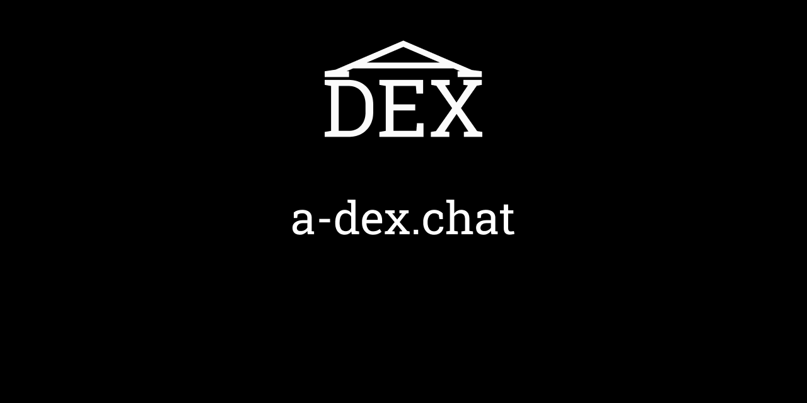

<p align="center">
	
</p>

# a-dex.chat-smart-contract

The a-dex.chat smart contract is designed for encrypted messaging on EOSIO chains via ECDHE protocol.

# Dependencies

* eosio 2.0^
* eosio.cdt 1.6^
* cmake 3.5^

# Compiling

```
./build.sh -e /root/eosio/2.0 -c /usr/opt/eosio.cdt
```

# Deploying

```
cleos set contract <your_account> ./build/Release/a-dex.chat a-dex.chat.wasm a-dex.chat.abi
```